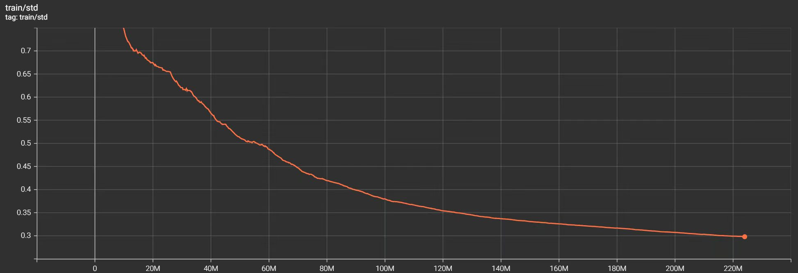
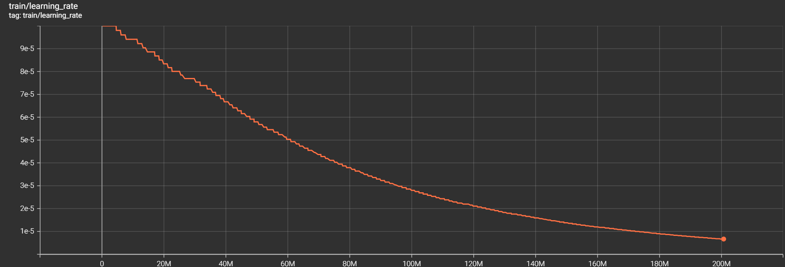
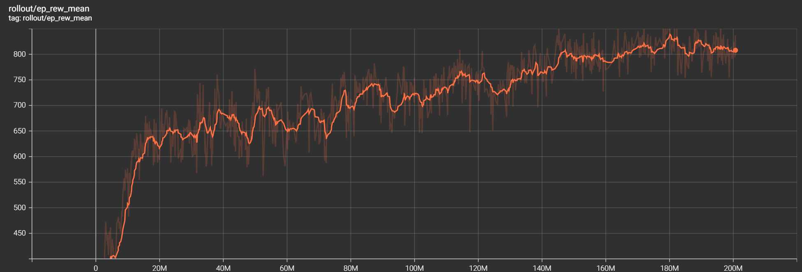
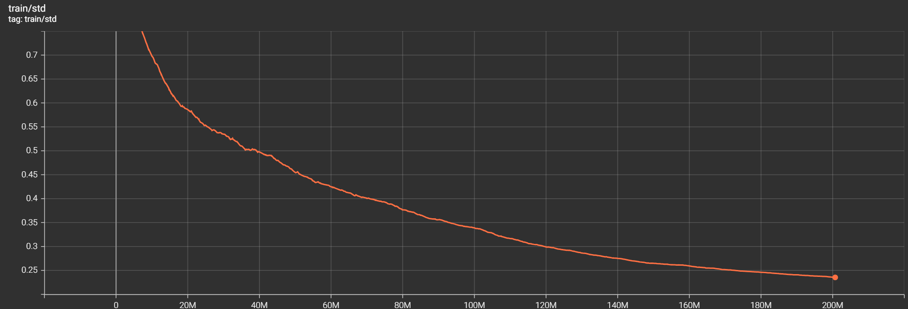
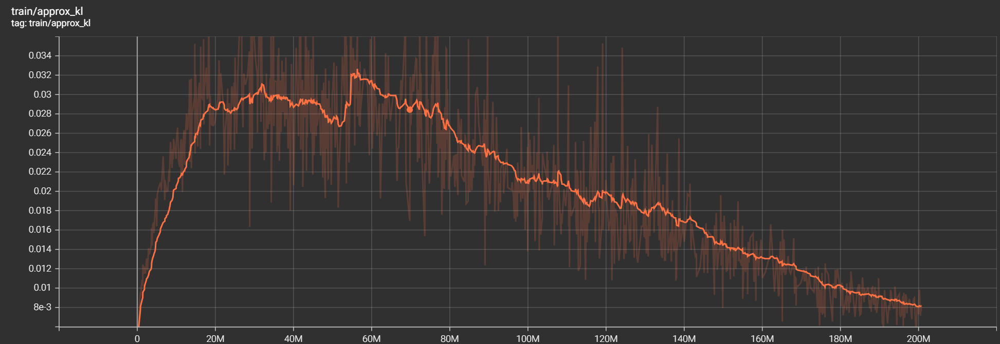
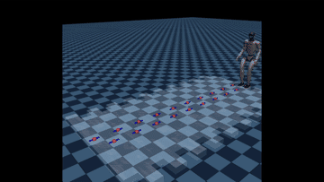
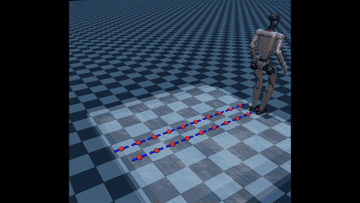
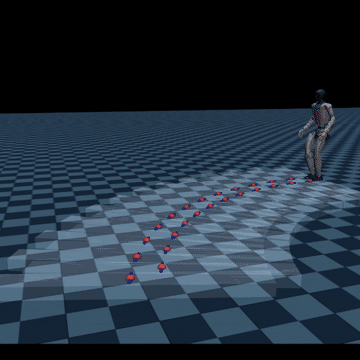
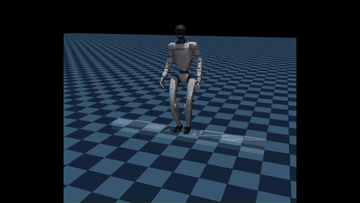
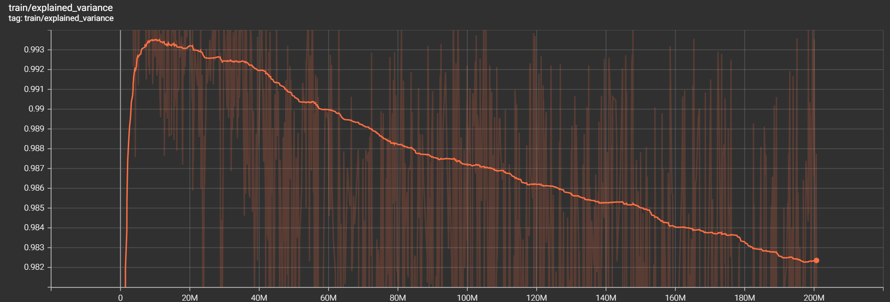

# G1 Omnidirectional Footstep Tracking Control

Deep reinforcement learning based omnidirectional footstep tracking control system for Unitree G1 humanoid robot.

[](https://www.python.org/)
[](https://pytorch.org/)
[](https://mujoco.org/)
[](https://stable-baselines3.readthedocs.io/)
[](LICENSE)
[](https://github.com/psf/black)
[](https://github.com/CYH-SWU/G1_RL_FootstepTracking/actions/workflows/ci.yml)
[](https://github.com/CYH-SWU/G1_RL_FootstepTracking/actions/workflows/lint.yml)

---

## 🤖Project Overview

This project builds an omnidirectional footstep tracking walking control system for the **Unitree G1** humanoid robot, trained in the **MuJoCo** physics simulation environment using the **PPO** algorithm. The robot receives pre-generated **footstep sequences** (including foot placement positions and orientations). The policy network takes proprioceptive information (joint angles/velocities, IMU attitude) and task instructions (footstep positions/yaws, gait phase) as input, and outputs **12-dimensional joint position** increment commands to drive both legs to accurately **track** each footstep, achieving stable omnidirectional bipedal walking.


## 🎛️Robot Model and Joint Configuration

- **Degrees of Freedom**: Unitree G1 with 29 DOF, 12 active joints in legs (3x hip, 1x knee, 2x ankle) per side.

- **Nominal Posture**:
    | Joint | Angle (rad) | Angle (deg) |
    |-------|-------------|-------------|
    | Hip pitch   | -0.5236 | -30.0 |
    | Knee pitch  |  0.8727 |  50.0 |
    | Ankle pitch | -0.3491 | -20.0 |
    | Waist pitch |  0.1500 |   8.6 |



*If the image(nominal_pose.jpg) does not load, please view it directly in the `docs/` folder.*

- **PD Controller Gains**:
    | Joint | KP | Dampratio | Torque Limits(Nm) |
    |-------|----|-----------|-------------------|
    | Hip   | 115 | 0.65      | +-139/+-88      |
    | Knee  | 172 | 0.55      | +-139 Nm        |
    | Ankle | 46  | 0.40      | +-50 Nm         |


## ⚙️Environment and Training Setup

### Supported Walking Modes
- FORWARD
- BACKWARD
- LATERAL
- CURVED
- STANDING

### Observation and Action Space

The environment adopts an **asymmetric observation design**: `actor_obs` contains only proprioceptive information that is readily available on real hardware, while `critic_obs` extends it with privileged simulation‑only information to assist value estimation during training.

- **actor_obs (41 dims)**:
Joint angles (12), joint velocities (12), pelvis height (1), current footstep position (3), next footstep position (3), current footstep yaw (1), next footstep yaw (1), gait phase (2), pelvis Euler angles (3), pelvis angular velocity (3).
- **critic_obs (17 + 41 dims)**:
Normalized actor_obs based on prior experience (41), **foot forces** (2), **linear velocity** (3), **joint torques** (12).
- **Action Space**:
12-dimensional continuous values in range [-1,1], mapped to joint angle increments via `action_scale=0.25`.
- **Control Cycle**:
0.015s (approx 66.7Hz), physics step 0.005s (200Hz).

### Gait Parameters
```bash
total_duration      1.10s
swing_duration      0.75s
stance_duration     0.35s

step_length         0.20m
step_width          0.237m
```

### 🎯Reward Function Design
```plaintext
Footstep Tracking Reward (weight 0.45):
  Core task reward that drives the robot to step onto target footholds.

Foot Force Phase Matching Reward (weight 0.15):
  Guides the policy to press down firmly during stance phase and lift off during swing phase.

Foot Velocity Phase Matching Reward (weight 0.175):
  Guides the policy to keep feet stationary during stance phase and move quickly during swing phase.

Torso Attitude Reward (weight 0.05):
  Encourages pelvis yaw to align with target footstep yaw, ensuring the robot walks in the correct direction.

Pelvis Height Reward (weight 0.05):
  Encourages pelvis height to be maintained near the nominal value of 0.7268m.

Upper Body Stability Reward (weight 0.05):
  Encourages minimizing the XY distance between head and pelvis to maintain upper body stability and avoid excessive torso swaying during walking.
```

### Training Hyperparameters
```bash
n_steps         2048
batch_size      64
n_epochs        3
gamma           0.99
gae_lambda      0.95
clip_range      0.18
learning_rate   1e-4
ent_coef        0.0001
max_grad_norm   0.5
n_envs          14

learning_rate is automatically adjusted by the performance callback during training.
```



*If the image(learning_rate.png) does not load, please view it directly in the `docs/` folder.*

### 📈 Curriculum Learning (Disabled!)

The environment supports curriculum learning for terrain height (0 → **0.05**m steps) via a built‑in interface (`set_difficulty`). However, for this training run, curriculum learning is **disabled** — all experiments are conducted on flat ground only.

### Network Architecture

- **Policy Class**: **Asymmetric Actor-Critic**(AsymmetricPolicy).
- **Actor Network**: Two hidden layers with 256 neurons each, ReLU activation.
- **Critic Network**: Two hidden layers with 256 neurons each, ReLU activation.
- **Network Independence**: Actor and Critic do not share parameters.
- **Weight Initialization**: Orthogonal initialization.
- **Action Distribution**: Diagonal Gaussian distribution.

### Data Augmentation and Normalization

- `MirrorWrapper`: 50% probability of flipping observations and actions left-right.
- `actor_obs`: Online normalization via `VecNormalize`. The statistics are updated continuously during training.
- `critic_obs`: Offline fixed normalization using pre‑collected statistics to ensure stable scaling of privileged information.


## 📂Project Structure

```plaintext
G1_RL_FootstepTracking/
├── env/
│   ├── g1_env.py                       # Main environment class
│   └── utils/                          # Environment modules
│       ├── config.py
│       ├── observation_builder.py
│       ├── reward_calculator.py
│       ├── step_sequence.py
│       └── terrain_generator.py
├── env_utils/                          # Environment utilities
│   ├── mirrorwrapper.py
│   └── reward_functions.py
├── rl/                                 # Training custom modules
│   ├── callbacks.py
│   └── policy.py
├── robot/                              # Robot configuration
│   ├── assets/
│   ├── gen_xml.py
│   └── unitree_g1.xml
├── scripts/                            # Auxiliary scripts
│   ├── compute_height.py
│   ├── compute_max_step.py
│   └── test_pose.py
├── tests/                              # Unit tests (pytest)
│   ├── test_env.py
│   ├── test_imports.py
│   ├── test_mirrorwrapper.py
│   ├── test_policy.py
│   └── test_step_sequence.py
├── pretrained_models/                  # Model
├── docs/                               # Documentation assets
├── train.py                            # Main training entry
└── test.py                             # Model testing entry
```

## 🔁Clone the Repository
```bash
git clone https://github.com/CYH-SWU/G1_RL_FootstepTracking.git
cd G1_RL_FootstepTracking
```

## Install Dependencies
```bash
uv sync --all-extras
```
⚠️**Note**: Python 3.12+ is required.


## 🚀Train the Model
### Generate the processed G1 robot XML file:
```bash
uv run python robot/gen_xml.py
```
### Start training from scratch:
```bash
uv run python train.py
```
```bash
uv run python train.py \
  ---iterations 7000 \
  --save_interval 700 \
  --eval_interval 20
```
### Resume training from a checkpoint:
```bash
uv run python train.py \
  ---iterations 7000 \
  --model checkpoints/ppo_g1_xxx_steps.zip \
  --norm checkpoints/vec_normalize_final.pkl
```


## 🎬Evaluate and Visualize
```bash
uv run python test.py \
  --model checkpoints/ppo_g1_final.zip \
  --norm checkpoints/vec_normalize_final.pkl \
  --episodes 20 \
  --difficulty 0.0
```
```bash
uv run python test.py \
  --model pretrained_models/ppo_G1_FootstepTracking.zip \
  --norm pretrained_models/vec_normalize.pkl \
  --episodes 20 \
  --difficulty 0.0
```


## 🛠️Auxiliary Scripts
### Compute the pelvis height under the nominal posture.
```bash
uv run python scripts/compute_height.py
```
### Compute the maximum achievable step length under the current config.
```bash
uv run python scripts/compute_max_step.py
```
### Visualize the robot's nominal posture.
```bash
uv run python scripts/test_pose.py
```


## 🔍Testing
### Run all unit tests with coverage
```bash
uv run pytest tests/ -v --cov=env --cov=rl --cov=env_utils --cov-report=term
```
### Check code style (Ruff)
```bash
uv run ruff check .
uv run ruff format . --check
```
### Auto-fix style issues
```bash
uv run ruff check . --fix && uv run ruff format .
```


## 🧪 CI/CD
This project uses GitHub Actions to automatically run:
- Unit tests (with coverage) on Python 3.12
- Linting and formatting check with Ruff

All CI jobs must pass before merging a pull request.

---

## 🏆 Results & Demo

### Training Performance

The policy was trained for **200,704,000**timesteps (**7,000 iterations**) using the default hyperparameters (see `pyproject.toml` and `train.py` for details). The **training curves** below show the learning dynamics:


*Mean episodic reward over training iterations. The reward converges after ~**7,000** iterations and stabilizes at approximately **800** in the final phase.*

*If the image(ep_rew_mean.png) does not load, please view it directly in the `docs/` folder.*


*Action standard deviation over training iterations. The value decays from ~**1.0** (initial random exploration) to ~**0.24** (deterministic exploitation).*

*If the image(std.png) does not load, please view it directly in the `docs/` folder.*


*Approximate KL divergence over training iterations. The value remains stable between **0.01** and **0.03**.*

*If the image(approx_kl.png) does not load, please view it directly in the `docs/` folder.*

---

### 📺 Demo Videos

#### 🏃 Forward Walking



*If the image(forward.gif) does not load, please view it directly in the `docs/` folder.*

<details>
  <summary>🔽 Lateral Walking Demo (click to expand)</summary>
  
  <br>
  <em>If the image does not load, please view it directly in the `docs/` folder.</em>
</details>

---

#### 🚶 Backward Walking



*If the image(backward.gif) does not load, please view it directly in the `docs/` folder.*

---

#### ↔️ Lateral Walking

<details>
  <summary>🔽 Lateral Walking Demo (click to expand)</summary>
  
  <br>
  <em>If the image does not load, please view it directly in the `docs/` folder.</em>
</details>

---

#### 🔄 Curved Walking



*If the image(curve.gif) does not load, please view it directly in the `docs/` folder.*

---

#### 🧍 Standing



*If the image(standing.gif) does not load, please view it directly in the `docs/` folder.*

---

### 📊 Training Environment

All experiments were conducted on the following setup:

| Component | Specification |
|-----------|---------------|
| OS | Windows Subsystem for Linux (WSL 2) |
| GPU | NVIDIA RTX 5060 |
| CPU | Intel Ultra 9 275HX |
| RAM | 32 GB |
| Python | 3.12 |
| RL Framework | Stable-Baselines3 (PPO) |
| Physics Engine | MuJoCo 3.0+ |

The training ran for approximately **22 hours**.

---

### 🚨 Known Limitations & Future Improvements!!!

#### Critic Overfitting

During training, the Critic network exhibited a tendency to overfit early, often reaching an `explained_variance` above **0.9** within the first few iterations while `value_loss` dropped below **10**.

Several factors contribute to this behavior:

- **Flat reward landscape**: The reward function is dominated by exponential terms and saturated activations, producing near‑constant values across most states (In the early stage of training, the average per-step reward is only **0.4** with a variance as low as **0.02**! ). 
- **Direct access to reward-correlated information**: The Critic network receives privileged information (foot forces, joint torques, linear velocity) that is directly used in the reward function.
- **Effective horizon saturation**: When `n_steps` is set too large, the accumulated reward over the trajectory tends to converge to a near-constant value across different states, reducing the variance in the target returns. 
- **Excessive network capacity**: The current `net_arch = [256, 256]` provides the Critic with sufficient capacity to memorize training samples.

**Recommendations for improvement**:

- **Adopt a residual critic architecture**: In AsymmetricPolicy, replace the standard value network with a residual structure: V(s) = value_baseline + tanh(value_net(s)) * scale.
- **Reduce network capacity**: Decrease `net_arch` from `[256, 256]` to `[128, 128]` or `[64, 64]` to limit the Critic's ability to memorize and encourage more generalizable representations.
- **Adjust privileged information selection**: Consider removing or down-weighting features that have a direct linear relationship with the reward signal (e.g., foot forces) to force the Critic to rely on more indirect state information.
- **Set a separate, lower learning rate for the Critic**: In `AsymmetricPolicy`, use parameter groups to assign a lower learning rate to the value network (e.g., `1e-5` or `5e-6`) while keeping the Actor at `1e-4`.
- **Training parameter adjustments**:Reduce `n_steps` from `2048` to `1024` to shorten the effective horizon. Increase `batch_size` from `64` to `128` to compensate for the reduced rollout length.



*If the image(explained_variance.png) does not load, please view it directly in the `docs/` folder.*

---

## 📚References
**Learning Humanoid Walking**

R. P. Singh et al., "Learning Bipedal Walking On Planned Footsteps For Humanoid Robots," in *IEEE-RAS Humanoids*, 2022.
R. P. Singh et al., "Learning Bipedal Walking for Humanoids with Current Feedback," *arXiv:2303.03724*, 2023.
R. P. Singh et al., "Robust Humanoid Walking on Compliant and Uneven Terrain with Deep RL," *IEEE Access*, 2024.
GitHub Repository: [https://github.com/rohanpsingh/LearningHumanoidWalking](https://github.com/rohanpsingh/LearningHumanoidWalking)

**Unitree RL Gym**

GitHub Repository: [https://github.com/unitreerobotics/unitree_rl_gym](https://github.com/unitreerobotics/unitree_rl_gym)


## 🎉Acknowledgments

- This project uses the Unitree G1 robot model, which is Copyright (c) 2016-2023 HangZhou YuShu TECHNOLOGY CO.,LTD. and is licensed under the BSD 3-Clause License.
- The footstep tracking framework is inspired by the Learning Humanoid Walking project by Rohan P. Singh, licensed under the BSD 2-Clause License.


## 📄 License

This project is licensed under the MIT License - see the [LICENSE](LICENSE) file for details.